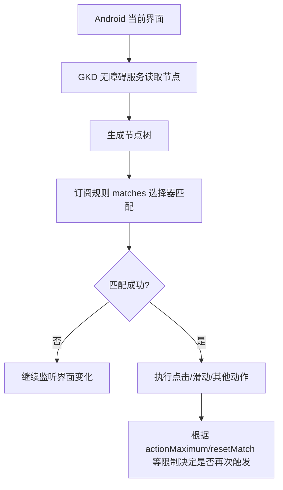
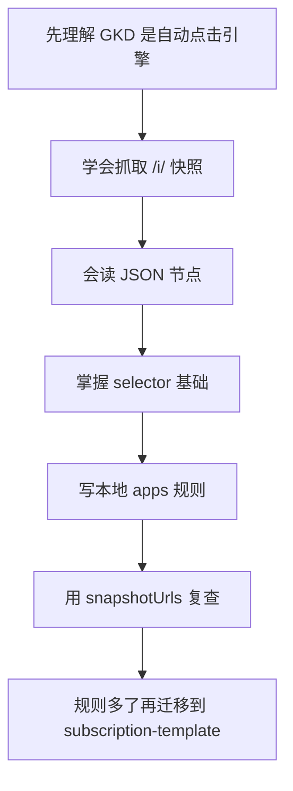

# GKD 项目深入了解

更新时间：2026-06-06

## 1. 项目一句话理解

GKD 是一款 Android 自动点击应用：它通过无障碍服务读取当前界面的节点树，再用类似 CSS 的高级选择器匹配目标节点，最后按订阅规则执行点击、滑动等动作。

| 维度 | 说明 |
|---|---|
| 项目名 | GKD |
| 官网 | https://gkd.li/ |
| 主仓库 | https://github.com/gkd-kit/gkd |
| 文档仓库 | https://github.com/gkd-kit/docs |
| 订阅模板 | https://github.com/gkd-kit/subscription-template |
| 核心技术 | Android 无障碍服务、节点树、选择器、JSON5 订阅 |
| 主要用途 | 跳过开屏广告、关闭弹窗、简化重复点击流程 |
| 默认规则 | GKD 默认不提供规则，需要用户添加本地规则或远程订阅 |

## 2. GKD 的工作模型



重点不是“识图”，而是“读节点”。截图只帮人看界面，真正决定规则的是快照 JSON 里的无障碍节点。

## 3. 核心组成

| 组成 | 作用 | 写规则时关注什么 |
|---|---|---|
| GKD App | Android 自动点击执行器 | 权限、订阅、运行状态 |
| 快照 | 保存某一刻界面状态 | 截图、包名、activity、节点树 |
| 选择器 | 匹配节点的语法 | `id`、`text`、`vid`、`clickable`、父子兄弟关系 |
| 订阅 | 规则集合 | `apps`、`globalGroups`、`categories` |
| 审查工具 | 网页查看快照 | 验证 selector 是否命中目标节点 |
| 订阅模板 | 远程订阅工程模板 | TypeScript 管理规则，构建 `gkd.json5` |

## 4. 订阅结构

GKD 的本地规则和远程规则格式一致，都是 JSON5。

```json5
{
  id: 233,
  name: 'Subscription',
  version: 0,
  author: 'author',
  updateUrl: 'https://example.com/gkd.json5',
  checkUpdateUrl: 'https://example.com/gkd.json5',
  supportUri: 'https://gkd.li/',
  categories: [],
  globalGroups: [],
  apps: [],
}
```

| 字段 | 作用 |
|---|---|
| `id` | 订阅唯一 id，远程订阅尤其要避免重复 |
| `name` | 订阅名称 |
| `version` | 订阅版本，用于更新判断 |
| `author` | 作者 |
| `updateUrl` | 远程订阅更新地址 |
| `checkUpdateUrl` | 检查更新地址 |
| `categories` | 分类定义 |
| `globalGroups` | 全局规则组 |
| `apps` | 应用规则列表 |

## 5. 应用规则结构

```json5
{
  id: 'com.gfd.ecprint',
  name: '小白智慧打印',
  groups: [
    {
      key: 1,
      name: '关闭广告弹窗',
      rules: [
        {
          matches: 'ImageView[id="com.gfd.ecprint:id/dg_dialog_frag_ads_popup_x"][clickable=true]',
          snapshotUrls: [
            'https://i.gkd.li/i/27824625',
          ],
        },
      ],
    },
  ],
}
```

| 层级 | 字段 | 说明 |
|---|---|---|
| App | `id` | Android 包名 |
| App | `name` | 应用名 |
| Group | `key` | 规则组编号，同一 App 内保持唯一 |
| Group | `name` | 规则组名称 |
| Rule | `matches` | 选择器 |
| Rule | `snapshotUrls` | 规则来源快照 |
| Rule | `activityIds` | 限定页面，快照有 activity 时建议加 |
| Rule | `actionMaximum` | 最大执行次数 |
| Rule | `matchTime` | 匹配时间窗口，常用于开屏广告 |
| Rule | `resetMatch` | 触发状态重置策略 |

## 6. 快照是什么

快照是 zip 文件，里面通常有：

```text
snapshot.zip
├─ 1778885167968.json
└─ 1778885167968.png
```

| 文件 | 作用 |
|---|---|
| `.json` | 包名、activity、设备信息、无障碍节点树 |
| `.png` | 当前界面截图，用于人工确认目标位置 |

快照链接有两类：

| 链接 | 是否适合给别人写规则 | 说明 |
|---|---:|---|
| `https://i.gkd.li/snapshot/...` | 否 | 本地临时页面，别人常打不开 |
| `https://i.gkd.li/i/...` | 是 | 分享快照，可下载 zip 分析 |

## 7. 快照到 zip 的转换

`https://i.gkd.li/i/27824625` 对应：

```text
https://github.com/user-attachments/files/27824625/file.zip
```

如果 GitHub 访问失败，可以用代理：

```powershell
$id = '27824625'
$url = [uri]::EscapeDataString("https://github.com/user-attachments/files/$id/file.zip")
curl.exe -k -L "https://proxy.gkd.li/?proxyUrl=$url" -o "$env:TEMP\gkd-$id.zip"
```

解压：

```powershell
Expand-Archive -LiteralPath "$env:TEMP\gkd-27824625.zip" -DestinationPath "$env:TEMP\gkd-27824625" -Force
```

## 8. 选择器语法核心

GKD 选择器类似 CSS，但面向 Android 节点。

| 写法 | 含义 |
|---|---|
| `TextView` | 匹配 `TextView` 节点 |
| `[id="xxx"]` | 匹配完整资源 id |
| `[vid="xxx"]` | 匹配短 id |
| `[text="跳过"]` | 文本等于 |
| `[text*="跳过"]` | 文本包含 |
| `[clickable=true]` | 可点击 |
| `A > B` | B 的父节点是 A |
| `A >n B` | B 的祖先节点是 A |
| `A - B` | 兄弟关系 |
| `@A > B` | 匹配路径成立，但最终点击 A |

选择器默认点击最后一个属性选择器命中的节点；如果要点击路径中间的节点，用 `@` 标记目标。

## 9. 选择器匹配方向

GKD 选择器是从右往左匹配。

```text
FrameLayout > TextView[id="xxx"]
```

它不是先找 `FrameLayout`，而是先找 `TextView[id="xxx"]`，再判断父节点是否是 `FrameLayout`。

这个点很重要：右侧条件越精确，查询越快、越稳。

## 10. 写规则的优先级

| 优先级 | 做法 | 原因 |
|---:|---|---|
| 1 | 用明确关闭按钮 id | 最稳定 |
| 2 | 加 `clickable=true` | 避免命中装饰图 |
| 3 | 加控件类型，如 `ImageView`、`View` | 缩小范围 |
| 4 | 有 activity 时加 `activityIds` | 减少误触 |
| 5 | 用父子/兄弟关系定位 | 适合目标节点没 id 的情况 |
| 6 | 用文本附近节点定位 | 适合按钮无文本但弹窗有标题 |
| 7 | 坐标点击 | 最后选择，稳定性差 |

## 11. 本地规则和远程订阅

| 类型 | 适合场景 | 特点 |
|---|---|---|
| 本地规则 | 自己临时用、少量规则 | 直接在 GKD 内编辑 |
| 远程订阅 | 多人维护、长期更新 | 用链接订阅，可自动更新 |
| subscription-template | 规则工程化维护 | TypeScript 分文件管理，构建成 `dist/gkd.json5` |

远程订阅推荐使用 `gkd-kit/subscription-template`。它的典型结构：

```text
subscription/
├─ src/
│  ├─ subscription.ts
│  ├─ categories.ts
│  ├─ globalGroups.ts
│  └─ apps/
├─ dist/
│  └─ gkd.json5
└─ package.json
```

## 12. 开发远程订阅的工具链

| 工具 | 用途 |
|---|---|
| Node.js >= 22 | 运行工具和校验选择器 |
| pnpm >= 9 | 包管理 |
| VS Code | 编辑规则、查看类型提示 |
| Prettier | 格式化 |
| ESLint | 检查规则代码 |
| GitHub Actions | 构建发布 `dist/gkd.json5` |

官方模板提示：选择器校验依赖 Node.js 22 的 WasmGC 能力。

## 13. 规则稳定性判断

| 规则写法 | 稳定性 | 说明 |
|---|---|---|
| `ImageView[id="完整id"][clickable=true]` | 高 | 关闭按钮有资源 id |
| `[vid="close"][clickable=true]` | 中高 | 短 id 可读性好，但可能重复 |
| `[text="跳过"]` | 中 | 文案可能变化 |
| `[text*="跳过"]` | 中低 | 容易误命中 |
| `View[index=3]` | 低 | 布局变化就失效 |
| 坐标点击 | 很低 | 分辨率和布局影响大 |

## 14. 常见规则类型

| 类型 | 常见字段 |
|---|---|
| 开屏广告 | `matchTime`、`actionMaximum`、`resetMatch: 'app'` |
| 弹窗广告 | 明确关闭按钮 id、`clickable=true` |
| 权限/确认弹窗 | 文本 + 父级按钮 |
| 任务流程确认 | 精确 activity + 文本按钮 |
| 全局跳过 | 文本包含“跳过”，但要严格限制长度和可见性 |

## 15. 常见误区

| 误区 | 问题 |
|---|---|
| 只发截图就想写规则 | 没有节点信息，只能猜 |
| 看到 X 就用坐标点 | 换设备/分辨率容易失效 |
| 点广告主体容器 | 可能打开广告 |
| 选择器过宽 | 容易误触其他按钮 |
| 不保存 `snapshotUrls` | 后续无法复查规则来源 |
| 不看 `activityId` | 可能在其他页面误触 |

## 16. 本项目当前目录已有文档

```text
D:\vbayyds_workspace\GKD广告规则
├─ GKD本地规则.md
├─ GKD规则编写流程.md
└─ GKD项目深入了解.md
```

| 文件 | 作用 |
|---|---|
| `GKD本地规则.md` | 当前“小白智慧打印”的规则成品 |
| `GKD规则编写流程.md` | 从快照写规则的操作流程 |
| `GKD项目深入了解.md` | 项目整体机制、结构、规则体系 |

## 17. 学习路线



## 18. 最小可用能力

如果只是帮用户写本地规则，掌握这 6 步就够：

1. 要求用户发 `https://i.gkd.li/i/...` 快照。
2. 下载对应 zip。
3. 解压读取 JSON。
4. 找 `appId`、`activityId`、`clickable=true` 节点。
5. 对照 PNG 确认关闭按钮。
6. 输出 `apps` 规则片段和完整本地订阅。

## 19. 参考链接

| 资料 | 链接 |
|---|---|
| GKD 官网 | https://gkd.li/ |
| GKD 是什么 | https://gkd.li/guide/what-is-gkd |
| 订阅规则 | https://gkd.li/guide/subscription |
| 选择器 | https://gkd.li/guide/selector |
| 选择示例 | https://gkd.li/guide/example |
| 查询优化 | https://gkd.li/guide/optimize |
| 快照审查 | https://gkd.li/guide/snapshot |
| API Reference | https://gkd.li/api/ |
| 主仓库 | https://github.com/gkd-kit/gkd |
| 订阅模板 | https://github.com/gkd-kit/subscription-template |
